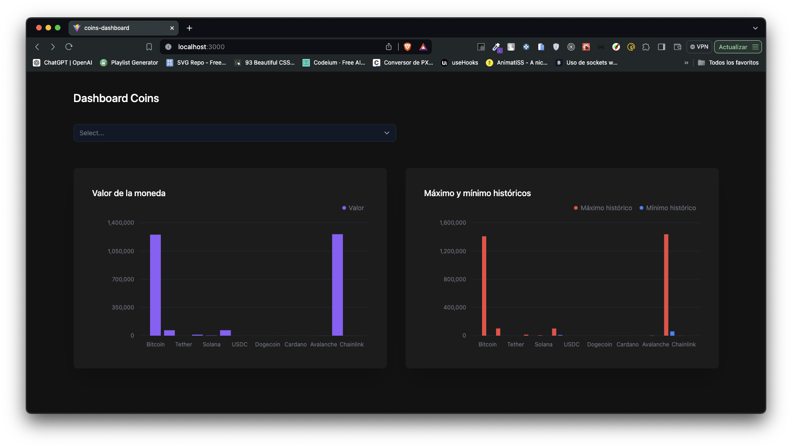
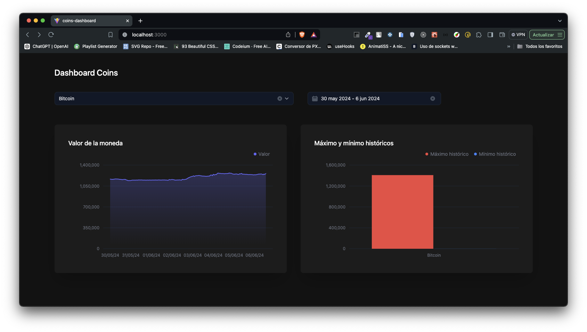

# Coins dashboard

## Enfoque
Para este proyecto se utilizó la API de CoinGecko para leer información sobre criptomonedas, dando un dashboard en el que se pueden obtener los datos del valor y los máximos y mínimos históricos de las monedas. Además se incluyen filtros por moneda y rangos de fechas.

## Stack utilizado
- React
- Tailwind
- Tailwind
- Tremor Components

## Proceso de instalación
1. Clonar el repositorio.

2. Descargar dependencias
```
yarn install
```

3. Configurar variables .env tomando el ejemplo del .env.template

4. Correr el proyecto
```
yarn dev
```

## Ejemplos de estados del proyecto

- Carga inicial


- Moneda seleccionada

